# Pinky-Pact 🤙

## Your word. On-chain.

Pinky-Pact is a Solana devnet habit accountability app where users create habit pacts, stake devnet SOL, invite witnesses, receive AI coaching from Pax, and get verifiable on-chain proof that their commitment exists.

Built for **Dev3Pack Global Hackathon 2026** by **Thobeka • Khatisani • Jared • Anele** from South Africa 🇿🇦.

---

## Live Links

- **Live Demo:** https://pinky-pact-opal.vercel.app/
- **Demo Video:**  https://youtu.be/v0EzSmOTU9g?si=Y0fqgqvoOia7HGO
- **GitHub Repo:** https://github.com/beko-1enkosi/pinky-pact

---

## Solana Devnet Program

Pinky-Pact includes a deployed Anchor/Rust smart contract on Solana devnet.

- **Network:** Solana Devnet
- **Program ID:** `3UoZ5ixtrtHVPRbsJfb5a9ZPPnXmYjCjcWqDmS3Z33xv`
- **Explorer:** https://explorer.solana.com/address/3UoZ5ixtrtHVPRbsJfb5a9ZPPnXmYjCjcWqDmS3Z33xv?cluster=devnet
- **Deployment Transaction:** https://explorer.solana.com/tx/5ZW9dmpnADK2X3SspGrjaGHVZW3a3LeswieQmqCYGvXMTWJjK6hXJsduAcWKNboUgK2Dy6amNp62KbRVJAWLHssP?cluster=devnet

The app currently performs a real `create_pact` transaction on devnet using Phantom wallet and Solana Wallet Adapter.

---

## Problem

People struggle to maintain personal habits alone. Existing habit apps usually rely on reminders, streaks, or notifications, but those are easy to ignore. There is no trusted accountability layer that combines:

- personal commitment,
- social witnesses,
- financial stakes,
- AI coaching,
- and verifiable proof.

Pinky-Pact makes commitment feel real.

---

## Solution

Pinky-Pact turns a habit into an on-chain pact.

A user can:

1. choose a habit,
2. choose a duration,
3. stake devnet SOL,
4. choose a penalty destination,
5. invite witnesses,
6. receive AI advice from Pax,
7. and create a verifiable Solana record of the pact.

If the user keeps their word, the stake can be returned. If they fail, the pact rules determine where the stake goes.

For the hackathon MVP, the deployed Solana program supports pact creation and the frontend demonstrates the full user journey with a mixture of real devnet transactions and polished demo flows.

---

## Sponsor / Track Integrations

### Solana

Pinky-Pact uses Solana as the trust and proof layer.

Implemented:

- Anchor/Rust smart contract
- Deployed to Solana devnet
- Phantom wallet connection
- Real devnet SOL balance display
- Real `create_pact` transaction
- PDA-based pact account derivation
- Devnet SOL escrow concept
- Solana Explorer proof links

Smart contract instructions:

- `create_pact`
- `invite_witness`
- `accept_witness_role`
- `check_in`
- `vote`
- `settle_pact`

### ElevenLabs

Pinky-Pact includes Pax, an AI accountability coach.

Implemented/demoed:

- Voice coach UI
- Coaching message generation logic
- Read-aloud experience for pact advice
- ElevenLabs-ready text-to-speech integration
- Browser speech fallback for demo reliability

Integration path:

- Generate Speech

### v0 / Vercel

The frontend was rapidly designed and refined using AI-assisted UI generation and prepared for Vercel deployment.

Implemented:

- Vite + React + TypeScript frontend
- Responsive UI
- Judge-friendly `/try-demo` flow
- Persona demos
- Vercel-ready build configuration

### OpenRouter

Pinky-Pact includes a small Pact Advisor chatbot called Pax.

Implemented/demoed:

- Floating chatbot on dashboard
- Pact advice prompts
- AI-advice integration structure
- Read-aloud support for assistant responses

---

## Product Demo Flow

The app has two ways to explore:

### 1. Judge demo mode

Open `/try-demo`.

Judges can enter as:

- Anele
- Khatisani
- Jared

Each persona shows a different Pinky-Pact experience using mock data.

### 2. Real devnet wallet mode

1. Connect Phantom wallet on Solana devnet.
2. Go to Create Pact.
3. Enter a habit.
4. Stake at least `0.01` devnet SOL.
5. Confirm the wallet transaction.
6. See the pact saved in the dashboard.
7. Open the Solana Explorer transaction link.

---

## Screenshots


### Home

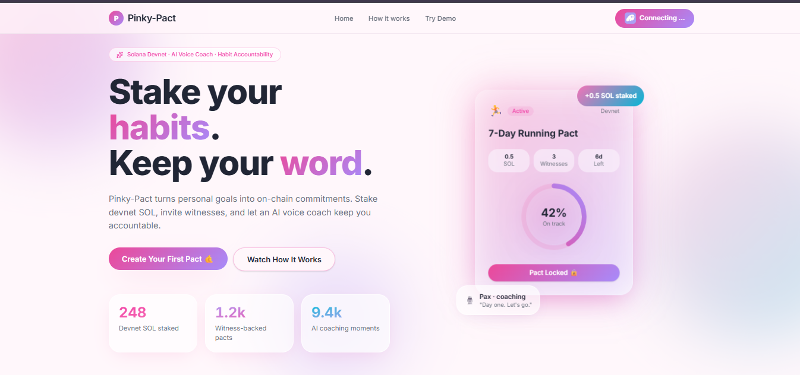

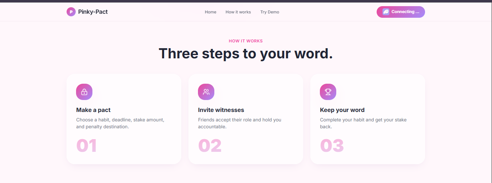

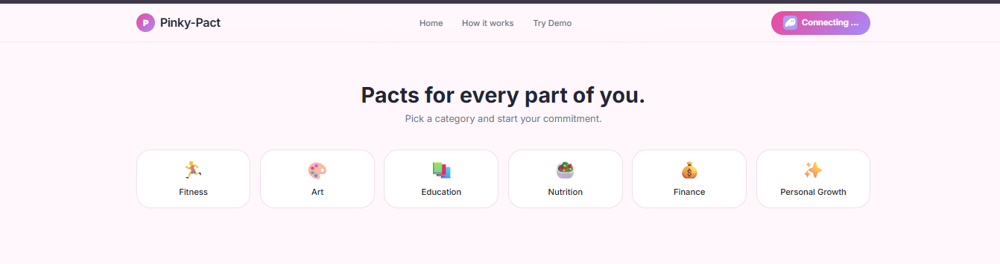

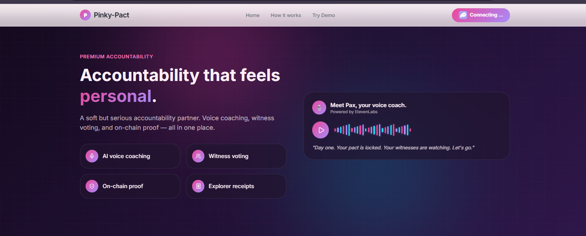

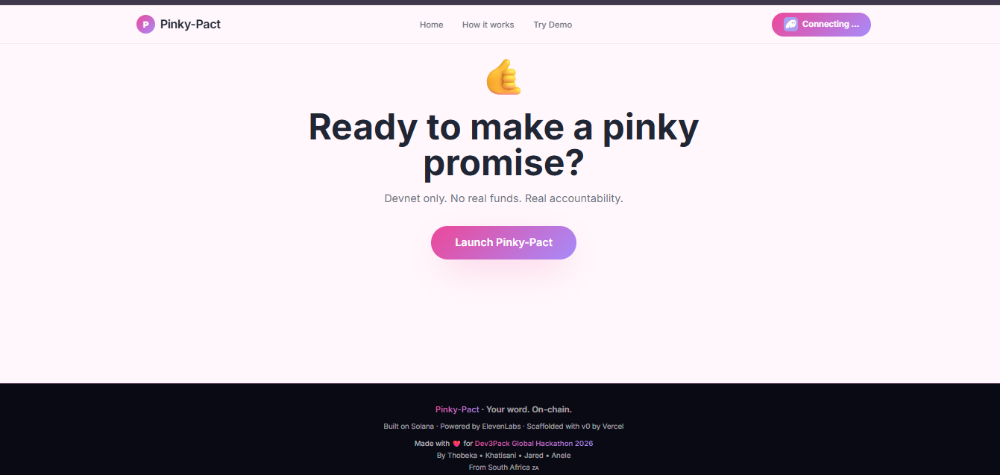

### Try Demo

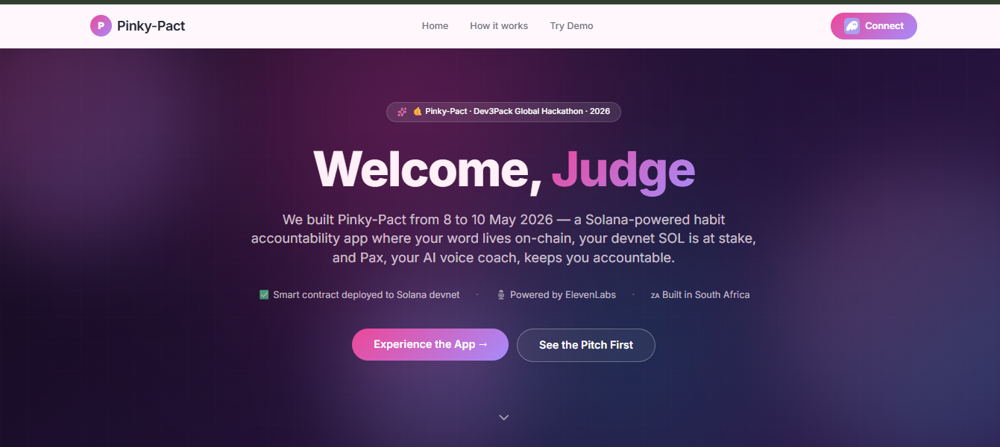

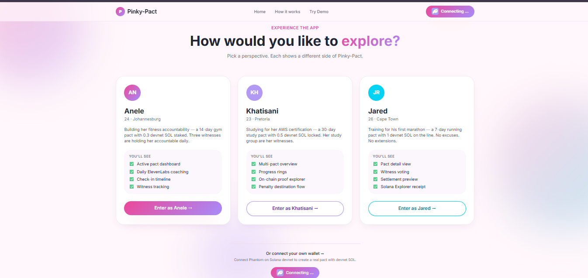

### Dashboard

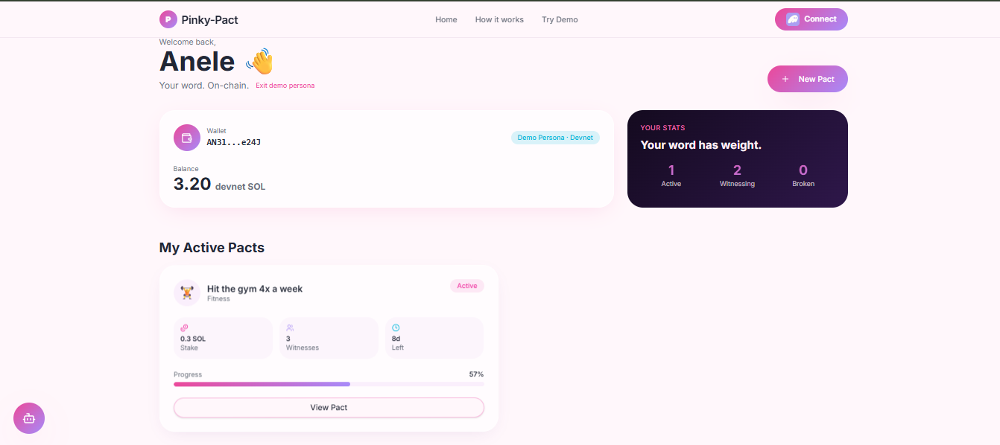

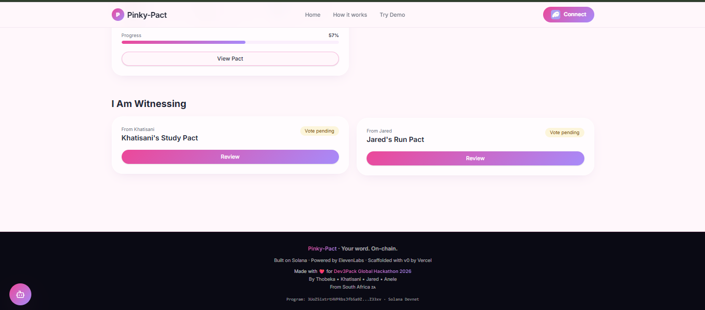

### Create Pact

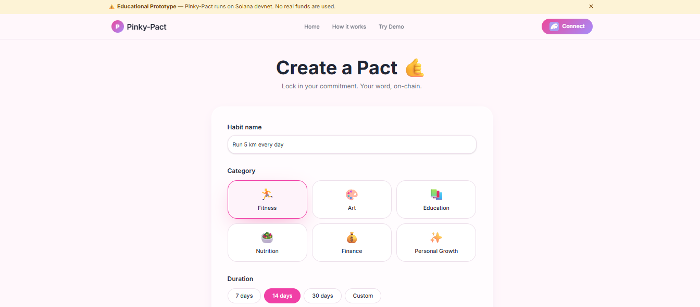

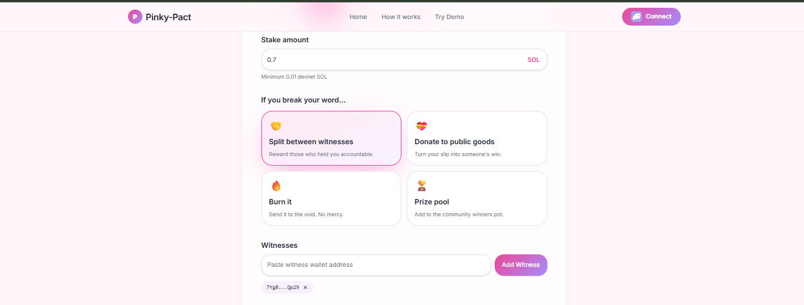

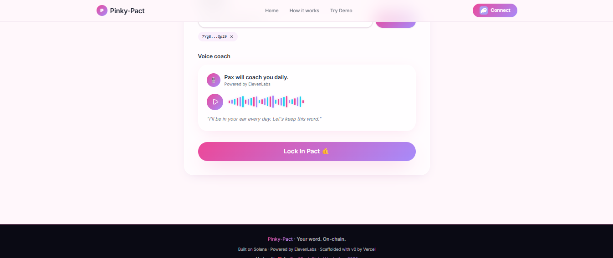


### Pact Advisor

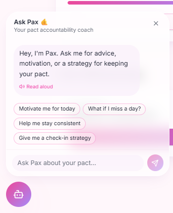

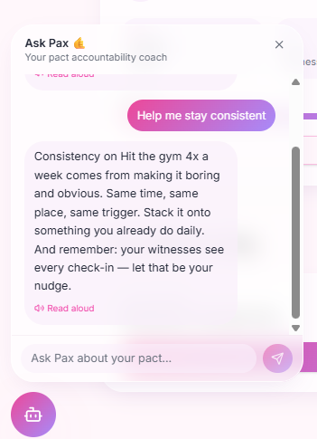

---

## Tech Stack

- Vite
- React
- TypeScript
- Tailwind CSS
- shadcn/ui
- Framer Motion
- Lucide React
- Solana Wallet Adapter
- Solana Web3.js
- Anchor/Rust
- ElevenLabs
- OpenRouter
- Vercel

---

## Environment Variables

Create `.env` locally using `.env.example`.

```env
VITE_ELEVENLABS_API_KEY=
VITE_ELEVENLABS_VOICE_ID=21m00Tcm4TlvDq8ikWAM
VITE_OPENROUTER_API_KEY=
VITE_OPENROUTER_MODEL=openai/gpt-4o-mini
VITE_PROGRAM_ID=3UoZ5ixtrtHVPRbsJfb5a9ZPPnXmYjCjcWqDmS3Z33xv
VITE_SOLANA_NETWORK=devnet
```
For Vercel, add these variables under:

**Project Settings → Environment Variables**

Do not commit real API keys.

---

## Local Setup

```bash
git clone git clone git@github.com:beko-1enkosi/pinky-pact.git
cd pinky/frontend
npm install
cp .env.example .env
npm run dev
```

Build:

```bash
npm run build
```

---

## Vercel Deployment

If deploying from GitHub:
* Root directory: `frontend`
* Framework: Vite
* Build command: `npm run build`
* Output directory: `dist`

Then add the environment variables listed above.

---

## Current MVP Scope

Implemented:
* Solana devnet program deployed
* Real Phantom wallet connection
* Real devnet SOL balance
* Real create pact transaction
* LocalStorage pact display
* Judge-friendly `/try-demo` page
* Persona demo flows
* Dashboard
* Create Pact page
* Pact Detail page
* Witness page
* Settlement page
* Pax chatbot
* Read-aloud coaching/advice
* Solana Explorer links

Mocked/demoed:
* witness acceptance frontend flow
* witness voting settlement payout
* penalty destination execution
* full ElevenLabs production backend
* full OpenRouter backend proxy

Planned:
* Full on-chain witness UI flow
* USDC staking
* LI.FI cross-chain funding
* Solana Mobile version
* Push notifications
* Witness reputation
* Group pact pools
* Backend proxy for AI keys

---

## Why Pinky-Pact Fits Solana

Pinky-Pact uses Solana for what blockchains are good at:
* verifiable commitments,
* escrow-like stake locking,
* transparent pact records,
* wallet-native identity,
* and public proof through Explorer links.

The core product is not just a normal habit tracker with a wallet button. The commitment itself is created through an on-chain program.

---

Disclaimer

Pinky-Pact is an educational hackathon prototype.

It runs on **Solana devnet only**. Devnet SOL is fake and has no real-world value. This is not financial advice, medical advice, legal advice, or a production accountability system.

---

## Team

Made with ❤️ for **Dev3Pack Global Hackathon 2026**

By **Thobeka • Khatisani • Jared • Anele**

From South Africa 🇿🇦